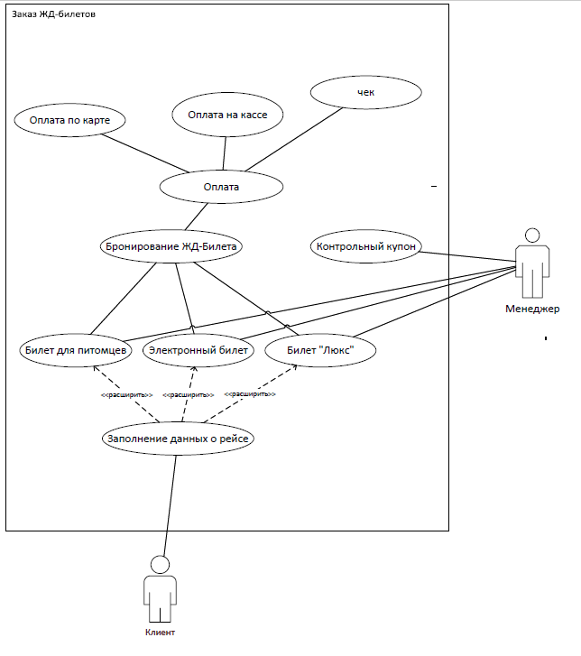

<table style="width: 100%;">
  <tr>
    <td style="text-align: center; border: none;">
    Министерство образования и науки РФ 
Государственное бюджетное профессиональное образовательное учреждение Республики Марий Эл 
Йошкар-Олинский технологический колледж
</td>
  </tr>
  <tr>
    <td style="text-align: center; border: none; height: 15em;">
    <h2 style="font-size:3em;">Курсовой Проект</h2>
      <h3>по дисциплине "Проектирование и дизайн Информационных систем"   Тема:<b> "Заказ ЖД-Билетов"<b> </h3></td>
  </tr>
  <tr>
      <td style="text-align: right; border: none; height: 20em;">
      Разработал: 
      Малинин Никита 
      Группа: И-31 
      Преподаватель: 
      Колесников Евгений Иванович
    </td>
  </tr>
  <tr>
    <td style="text-align: center; border: none; height: 5em;">
    г.Йошкар-Ола,  2021</td>
  </tr>
</table>

Наша компания предлагает транспортные услуги по сети железных дорог. У нас вы можете заказать билеты на ближайшие рейсы в течении 45 дней.

 на нашем сайте имеется бронирование билетов.
В качестве подтверждения о заключении договора перевозки пассажир получает бланк заказа в электронном виде, содержащую сведения о заказе и перечнем предоставляемых услуг.
 Но для того, чтобы пройти регистрацию на рейс и воспользоваться услугами, 
как правило вполне достаточно предъявить документ, удостоверяющий личность пассажира. 
На оплату созданного заказа отводится 15 минут перед отправлением поезда.

Для каждых пассажиров имеется свой билет под ситуации. В наличии имеются обычный электронный билеты, билеты для пассажиров с питомцами и билеты "Люкс".

Чтобы забронировать билет на поезд, выберите маршрут и дату, укажите станции отправления и назначения. 
На экране вы увидите информацию об интересующем вас маршруте: время отправления и прибытия поездов, типы вагонов (купе, мягкий, плацкарт, общий), 
цену, продолжительность поездки и остановки в пути. Выберите нужный поезд и количество пассажиров, затем введите персональные данные,
 выберите способ оплаты и подтвердите заказ.

 Если за это время вы не оплатите заказ, места станут доступны другим покупателям. 

